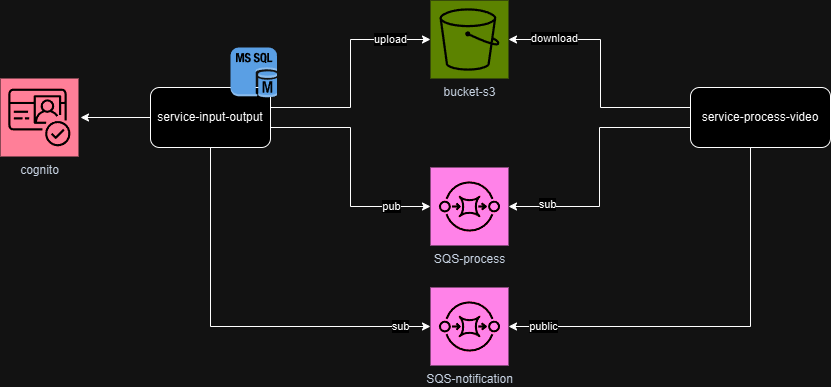
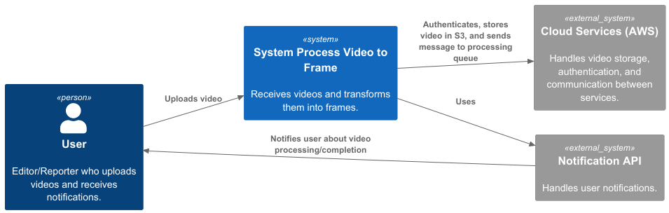
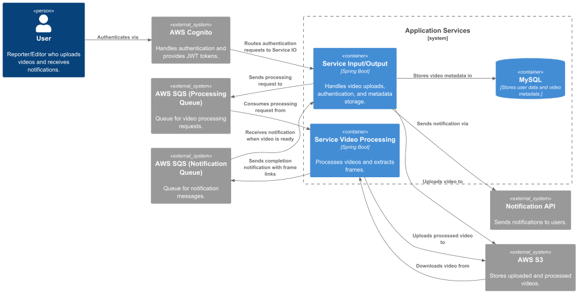
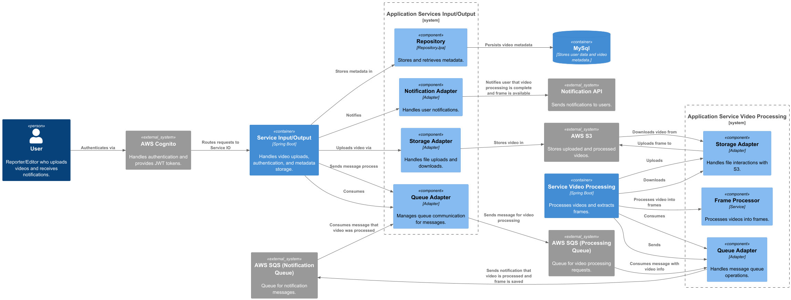
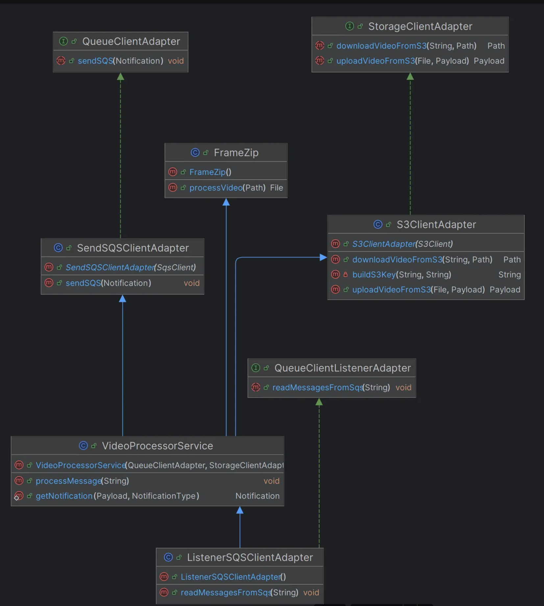

## Watlas Rick Braga Trindade

# Storytelling - SVA’s (Serviços de Valor Agregado);

#### Da Gravação à Notícia: Automatizando o processo de notícias

Em uma emissora de TV, cada segundo conta. Os repórteres enviam seus vídeos
diretamente do campo, e a equipe digital precisa transformar esse conteúdo rapidamente
em imagens para redes sociais e portais de notícias. No entanto, antes, havia um problema:

1. Processos manuais lentos.
2. Demora no processamento de vídeos.
3. Dificuldade na notificação sobre o status do conteúdo.


   Com esses desafios dificultando e atrasando a geração de notícias, a emissora adotou um
   sistema capaz de gerar imagens de alta qualidade a partir dos vídeos enviados pelos
   repórteres. Mas como funciona?
   O jornalista acessa o sistema, autentica-se e, em seguida, pode realizar o upload dos
   vídeos. Como nosso sistema é eficaz e escalável, o repórter pode enviar quantos vídeos
   forem necessários.
   Após o upload, o sistema inicia automaticamente a análise do vídeo e gera imagens de alta
   qualidade. Assim, o usuário recebe uma notificação informando se o processo foi concluído
   com sucesso ou se houve alguma falha. Se concluído com sucesso irá aparecer no sistema
   as imagens.
   Agora, a equipe não precisa mais perder tempo extraindo imagens manualmente. O sistema
   entrega imagens prontas, reduzindo em 70% o tempo de publicação nas redes e portais.

## Aprendizados Esperados com o Projeto

Este projeto permite explorar diversos desafios técnicos e estratégicos, incluindo:

● Implementação de um **fluxo eficiente de processamento de vídeos e extração de
imagens**.

● Melhor abordagem para **escalar a solução na nuvem** de forma sustentável.


```
● Otimização da latência e do tempo de resposta para os usuários.
● Garantia de segurança e confiabilidade no armazenamento e manipulação dos
vídeos.
● Integração de diferentes serviços AWS para automação do processamento.
```
## Perguntas-Chave a Serem Respondidas

Para avaliar o sucesso do projeto, algumas questões críticas precisam ser respondidas:

**Desempenho**

● Qual a latência esperada do upload ao processamento final?

**Escalabilidade**

● O sistema suporta picos de tráfego, como grandes eventos ao vivo?

**Segurança**

● Como garantir que apenas usuários autenticados possam acessar os vídeos?

**Automação**

● O fluxo de notificações ao usuário é eficiente?

**Custo**

● Como otimizar os custos de armazenamento e processamento sem comprometer o
desempenho?

## Principais Riscos do Projeto

```
● Sobrecarga do sistema devido a um alto volume de vídeos.
● Falhas na comunicação entre serviços (SQS, banco de dados, processamento).
● Problemas de latência , impactando a entrega das imagens processadas.
● Custos elevados com armazenamento e processamento na nuvem.
● Vulnerabilidades de segurança , como exposição indevida de vídeos.
```

## Plano de Aprendizado e Experimentação

Para obter respostas concretas, serão realizados testes e experimentos:
● **Criar testes de carga** , simulando diferentes volumes de usuários.

● **Medir tempos de resposta** do pipeline completo.

● **Testar estratégias de armazenamento e caching** para otimizar desempenho.

● **Realizar auditorias de segurança** na API e permissões do S3.

## Plano de Mitigação de Riscos

```
● Escalar automaticamente o processamento com filas SQS.
● Implementar monitoramento contínuo com New Relic e CloudWatch.
● Aplicar políticas de segurança rigorosas , utilizando IAM e Cognito.
● Criar mecanismos de retry, evitando falhas no processamento.
● Implementar controle de custos no AWS S3 e Lambda.
```
## Principais Partes Interessadas e Expectativas

```
Parte Interessada          Expectativa

Equipe de TI               -> Arquitetura escalável e segura.
Jornalistas/Editores       -> Rapidez na extração de imagens.
Equipe de Operações        -> Sistema confiável e fácil de manter.
Executivos da emissora     -> Redução de custos e aumento da eficiência.
```
#### Usuários e Seus Objetivos

```
● Repórteres/Jornalistas : Enviar vídeos com rapidez e segurança.

● Editores : Acessar e baixar imagens processadas para uso em notícias.

● Gestores de Conteúdo : Monitorar o processamento e gerenciar permissões.
```

## Piores Cenários Possíveis

```
● Sistema sobrecarregado : aumentando drasticamente o tempo de processamento.

● Falha na autenticação : expondo vídeos sigilosos.

● Erros no pipeline : resultando na perda de vídeos antes da publicação.

● Crescimento descontrolado dos custos de infraestrutura.
```
## Arquitetura da Solução

##### Modelo FreeForm - Versão inicial


A arquitetura inicial proposta inclui os seguintes componentes:

#### Componentes e Funções

```
● AWS Cognito : Gerência autenticação e autorização dos usuários.
● Service Input/Output : Controla upload de vídeos, integração com banco de dados e
envio de notificações.
● Bucket S3 : Armazena os vídeos enviados pelos usuários.
● Service Process Vídeo : Processa os vídeos e extrai imagens.
● SQS Process : Gerência mensagens de processamento de vídeo.
● SQS Notification : Envia notificações de sucesso ou erro para os usuários.
● Banco de Dados : Armazena informações sobre usuários e vídeos.
```
## Requisitos Essenciais do Sistema


1. **Alta disponibilidade** : O sistema deve estar sempre operante para não prejudicar a
   emissora.
2. **Baixa latência** : Upload, processamento e entrega das imagens devem ser rápidos.
3. **Segurança** : Proteção dos vídeos sensíveis e restrição de acessos não autorizados.
4. **Escalabilidade** : Suporte a picos de tráfego sem perda de desempenho.
5. **Extração de imagens de qualidade** : Fundamental para garantir boa apresentação
   visual.

## O que o Diagrama da Arquitetura ajuda a entender?

```
● O fluxo de dados entre os componentes.
● Como os serviços AWS se comunicam.
```
#### Padrões Essenciais na Arquitetura

```
● Uso de SQS para desacoplamento e escalabilidade.
● Autenticação centralizada com Cognito.
● Processamento assíncrono para vídeos.
● Armazenamento seguro em S3, garantindo disponibilidade.
```
#### Padrões Ocultos

```
● Controle de custos com tiering no S3 (armazenamento frio para vídeos antigos).
```
## Tomada de Decisões e Desafios

#### Metamodelo:

```
● Banco de dados : Optamos por SQL devido à necessidade de estrutura bem
definida.
● Uso de SQS : Decidimos usar filas para evitar gargalos no processamento.
```
#### Dificuldades nas Decisões

```
● Tempo de processamento : Será validado através de testes para garantir
atendimento ao SLA.
● Custo do S3 : Monitoramos o impacto financeiro e ajustaremos conforme
necessário.
```
#### Decisões sob incerteza

```
● Escolha do S3 como principal armazenamento : Um banco NoSQL foi
considerado, mas descartado.
```

## Arquiteturas no modelo C4

#### Nível de Contexto

```
● Usuários fazem upload de vídeos.
● O sistema processa os vídeos e extrai imagens.
● Imagens são armazenadas e disponibilizadas.
● O usuário recebe notificações sobre o status do processamento.

**Componentes envolvidos:**
● Usuário (Repórter/Editor)
● Sistema de processamento de vídeo
● Cloud Services (AWS)
● Sistema externo de Notificação
```


### Nível de Container
```
- Upload do Vídeo
● O usuário envia um vídeo através do sistema.

- O Service IO recebe o vídeo e:
● Armazena os metadados do vídeo (nome, status, timestamps, etc.) no **MySql**.
● Faz o upload do vídeo para o AWS.
● Envia uma mensagem para a fila AWS SQS (Processing Queue) para indicar que o vídeo deve ser processado.

- Processamento do Vídeo
● O Service Process Video escuta a fila AWS SQS (Processing Queue) e recebe a mensagem de processamento.
● O Service Process Video baixa o vídeo do AWS S3 e executa o processamento necessário.
● O Service Process Video faz Upload do frame do video no AWS

- Após o processamento, ele:
● Envia uma mensagem para a fila AWS SQS (Notification Queue) indicando que o processamento foi concluído.

- Atualização do Status no Banco
● O Service IO escuta a fila AWS SQS (Notification Queue) e recebe a mensagem de que o processamento terminou.
● O Service IO acessa o MySql e atualiza o status do vídeo para "processado".

- Notificação do Usuário
● O Service IO chama o Notification Service para enviar a notificação ao usuário.
● O Notification Service notifica o usuário sobre a conclusão do processamento.
```


#### Nível de Componente

#### Service IO (Input/Output Service)

```
● Responsabilidades:
○ Recebe os vídeos enviados pelo usuário.
○ Autentica usuários usando AWS Cognito.
○ Armazena metadados no banco MySql.
○ Faz o upload dos vídeos para o AWS S.
○ Envia mensagens para a AWS SQS (Processing Queue) com a solicitação
de processamento de vídeos.
○ Escuta a fila de notificações AWS SQS (Notification Queue) para atualizar o
status do processamento.
● Interações:
○ Cognito: Interage para validar a autenticação do usuário.
○ MySql: Armazena os metadados dos vídeos.
○ S3: Armazena os vídeos enviados pelo usuário.
○ SQS Processing Queue: Envia mensagens para o processamento dos
vídeos.
○ SQS Notification Queue: Escuta mensagens de status de processamento e
```
#### envia notificações ao usuário.

#### Service Process Video

```
● Responsabilidades:
○ Processa os vídeos recebidos da fila SQS (Processing Queue).
○ Baixa os vídeos do AWS S3 para o processamento.
○ Faz upload do frames do video processado no AWS S3.
○ Após o processamento, envia uma mensagem para a SQS (Notification
Queue) , informando sobre a conclusão do processamento.
● Interações:
○ SQS Processing Queue: Recebe mensagens com as solicitações de
processamento de vídeos.
○ S3: Faz o download dos vídeos para processá-los, e Upload dos frames dos
vídeos.
○ SQS Notification Queue: Envia mensagens de status de processamento,
sinalizando que o vídeo foi processado.
```
#### Notification Service

```
● Responsabilidades:
○ Envia notificações para os usuários, informando sobre a conclusão do
processamento dos vídeos.
```



#### Nível de Código

diagramas de classes UML do sistema Service Video Processing


